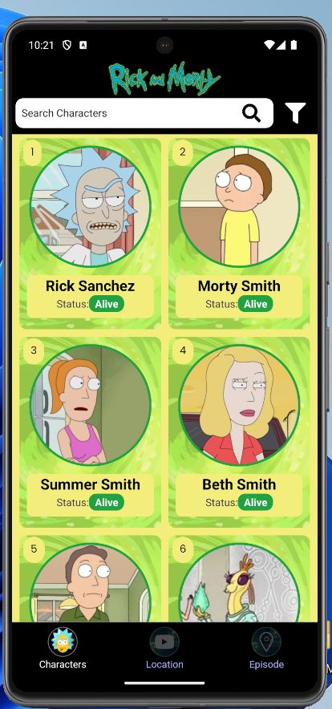
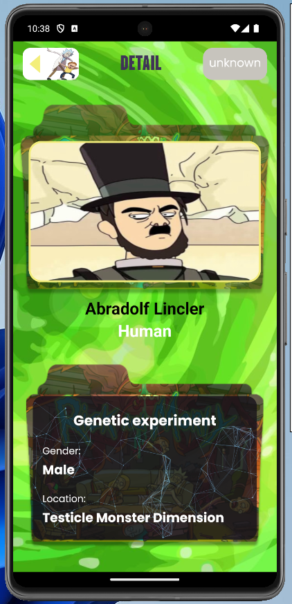
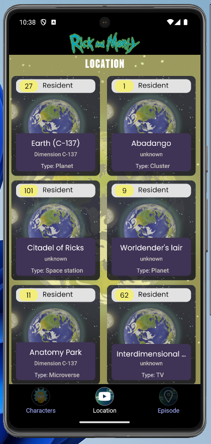
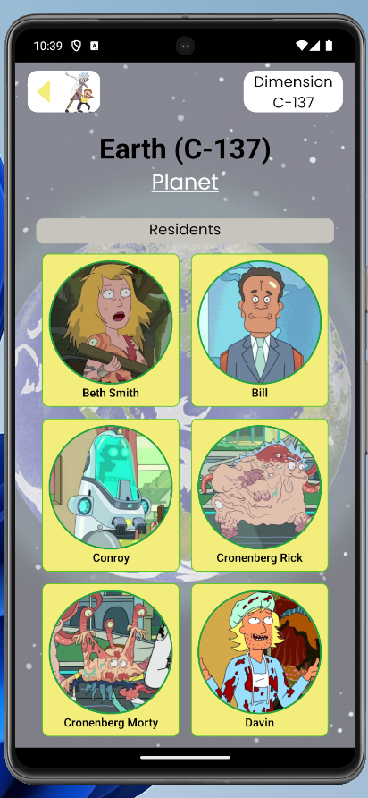
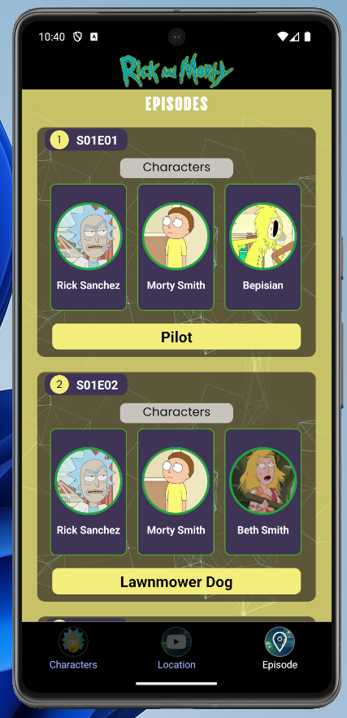
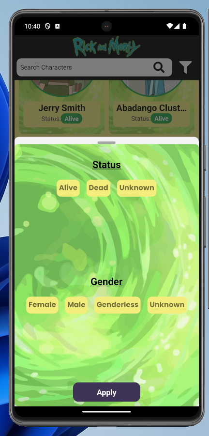

# Rick & Morty App 

Bu proje, React Native kullanılarak geliştirilmiş  Rick and Morty App uygulamasıdır. 
Uygulama, Rick and Morty dizisindeki karakterleri, mekanları ve bölüm bilgilerini görüntülemek için tasarlanmıştır.

# Özellikler
- Karakterlerin listesi
- Search özelliği
- Status ve gender type göre filtreleme
- Karakter Detay sayfası
- Location listesi
- Location Detayı ve sakinleri
- Episode listesi
- Episode Detayı (bölüm karakterleri listesi)
- Redux Toolkit ile state yönetimi
- Axios ile restApi işlemleri

Base url: https://rickandmortyapi.com/api

** proje kod izlemesi için paylaşılmıştır. style ve image lar yüklenmemiştir....

## Preview

# Rick-Morty-ReduxTK_React-Native
